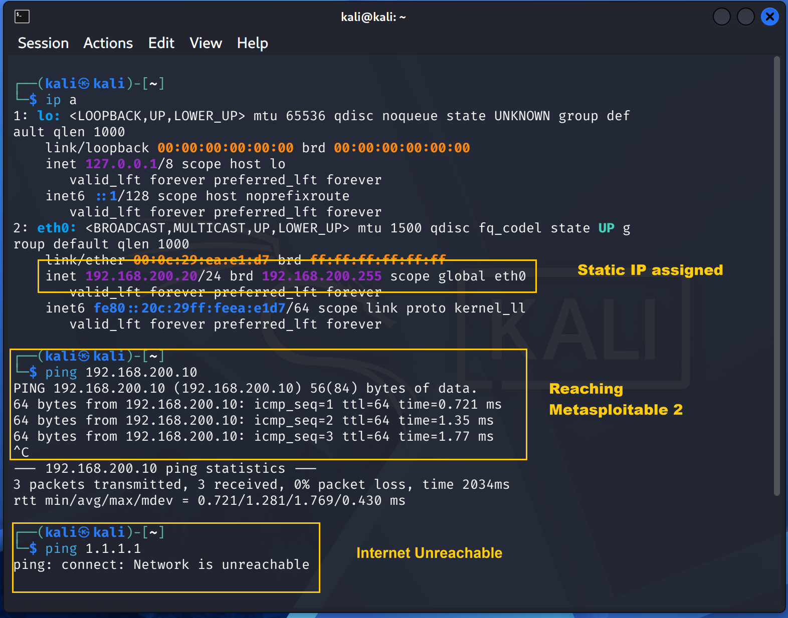

# Kali Linux Setup

## Overview

Kali Linux is the security workstation for the home cybersecurity lab.

It is used to perform reconnaissance, network analysis, vulnerability assessment, and controlled exploitation against the intentionally vulnerable Metasploitable 2 VM.

## VM Configuration

| Setting          | Value                |
| ---------------- | -------------------- |
| Operating system | Kali Linux           |
| Role             | Security workstation |
| VMware network   | `CYBERLAB`           |
| Network adapter  | 1                    |
| IP address       | `192.168.200.20/24`  |
| Default gateway  | None                 |
| DNS              | None                 |

## Network Verification

Kali is connected only to the `CYBERLAB` VMware LAN Segment.

The following connectivity was verified:

| Test                    | Expected Result | Status |
| ----------------------- | --------------- | ------ |
| Kali → Metasploitable 2 | Reachable       | PASS   |
| Kali → Internet         | Unreachable     | PASS   |
| Default route           | None            | PASS   |

Metasploitable 2 is available at:

```text
192.168.200.10
```

## System Configuration

The Kali VM was installed as the lab's security workstation.

System configuration and package updates should be performed before beginning security exercises.

Verify the system with:

```bash
cat /etc/os-release
hostnamectl
ip addr
ip route
```

## Security Tools

The following tools are used in the lab:

* Nmap — network discovery and service enumeration
* Wireshark — packet capture and network analysis
* Metasploit — controlled vulnerability assessment and exploitation
* Hydra — controlled authentication testing

Individual tool configuration and usage are documented separately in the `tools/` directory.

## Verification

Kali can communicate with the Metasploitable 2 target:

```bash
ping -c 4 192.168.200.10
```

Internet connectivity is intentionally unavailable:

```bash
ping -c 3 8.8.8.8
```

The expected result is failed Internet connectivity.



## Lab Role

Kali is the attack/security workstation.

Metasploitable 2 is the intentionally vulnerable target.

All testing is performed within the isolated `CYBERLAB` VMware network.
