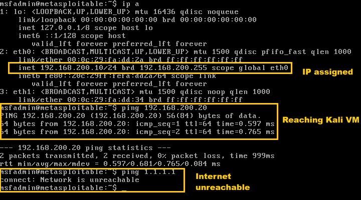

# Metasploitable 2 Setup

## Overview

Metasploitable 2 is the intentionally vulnerable target machine used for controlled security testing in the home cybersecurity lab.

It is designed to provide vulnerable services and applications for practicing reconnaissance, enumeration, vulnerability assessment, and exploitation.

## VM Configuration

| Setting          | Value               |
| ---------------- | ------------------- |
| Operating system | Metasploitable 2    |
| Role             | Vulnerable target   |
| VMware network   | `CYBERLAB`          |
| Network adapter  | 1                   |
| IP address       | `192.168.200.10/24` |
| Default gateway  | None                |
| DNS              | None                |

## Network Configuration

Metasploitable 2 is connected only to the `CYBERLAB` VMware LAN Segment.

The VM has no connection to:

* Home network
* Internet
* NAT
* Bridged networking
* Host-only networking

No default gateway or DNS server is configured.

## Connectivity Verification

Metasploitable 2 can communicate with the Kali security workstation:

```bash
ping -c 4 192.168.200.20
```

Result: **PASS**

Kali Linux is configured with:

```text
192.168.200.20/24
```

Internet connectivity from Metasploitable 2 is intentionally unavailable.

Result: **PASS — isolation confirmed**

## Intended Use

Metasploitable 2 is used as the target for controlled lab exercises.

Planned activities include:

* Network discovery
* Service enumeration
* Vulnerability identification
* Controlled exploitation
* Authentication testing
* Packet analysis

Testing is performed only from the Kali VM within the isolated `CYBERLAB` network.

## Security Considerations

Metasploitable 2 is intentionally vulnerable and should not be connected to a production network, home LAN, or the public Internet.

The VM should remain connected only to the isolated `CYBERLAB` VMware LAN Segment.

## Verification Commands

Useful commands for verifying the network configuration include:

```bash
ifconfig
route -n
```

From Kali, the target can be verified with:

```bash
ping -c 4 192.168.200.10
```

The expected result is successful communication between Kali and Metasploitable 2 while Internet connectivity remains unavailable.

