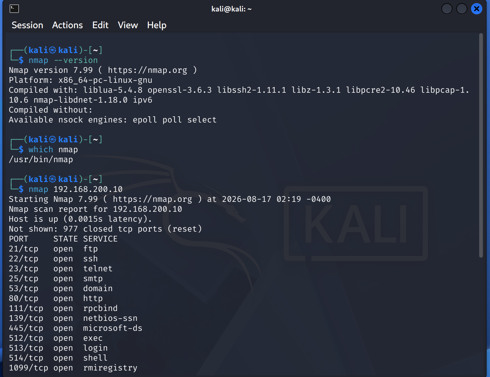

# Nmap

## Overview

Nmap (Network Mapper) is a network discovery and security auditing tool used to identify hosts, open ports, running services, and service versions.

In this lab, Nmap is used from Kali Linux to perform reconnaissance against the isolated Metasploitable 2 target.

## Installation and Verification

Kali Linux includes Nmap by default.

Verify the installation with:

```bash
nmap --version
```

Find the executable location with:

```bash
which nmap
```

If Nmap is not installed:

```bash
sudo apt update
sudo apt install nmap
```


## Target

The lab target is:

```text
Metasploitable 2
IP address: 192.168.200.10
```

Kali Linux:

```text
IP address: 192.168.200.20
```

All Nmap testing is performed within the isolated `CYBERLAB` VMware LAN Segment.

## Basic Syntax

```bash
nmap <target>
```

Example:

```bash
nmap 192.168.200.10
```

This performs a basic TCP port scan against the target.

## Common Scans

### Basic Port Scan

```bash
nmap 192.168.200.10
```

Used to identify common open TCP ports.

### Service and Version Detection

```bash
nmap -sV 192.168.200.10
```

Attempts to identify the services and versions running on discovered ports.

### Operating System Detection

```bash
sudo nmap -O 192.168.200.10
```

Attempts to identify the target operating system.

### Aggressive Scan

```bash
sudo nmap -A 192.168.200.10
```

Enables several advanced detection features, including OS detection, version detection, script scanning, and traceroute.

Use this only when the additional scan activity is appropriate for the lab exercise.

### Specific Ports

```bash
nmap -p 22,80,443 192.168.200.10
```

Scans only the specified ports.

### Full TCP Port Scan

```bash
nmap -p- 192.168.200.10
```

Scans all TCP ports from 1 through 65535.

## Useful Options

| Option | Purpose                                      |
| ------ | -------------------------------------------- |
| `-p`   | Specify ports                                |
| `-p-`  | Scan all TCP ports                           |
| `-sV`  | Detect service versions                      |
| `-O`   | Attempt OS detection                         |
| `-A`   | Enable aggressive detection features         |
| `-sC`  | Run default NSE scripts                      |
| `-Pn`  | Treat host as online and skip host discovery |
| `-oN`  | Save output in normal text format            |
| `-oX`  | Save output as XML                           |
| `-oA`  | Save output in multiple formats              |

## Saving Scan Results

Save a scan as normal text:

```bash
nmap -sV 192.168.200.10 -oN scan.txt
```

Save results in multiple formats:

```bash
nmap -sV 192.168.200.10 -oA metasploitable-scan
```

This creates files with the same base name using Nmap's supported output formats.

## Lab Workflow

The recommended workflow is:

```text
1. Confirm target connectivity
        ↓
2. Discover open ports
        ↓
3. Identify services
        ↓
4. Identify service versions
        ↓
5. Research discovered services
        ↓
6. Assess potential vulnerabilities
        ↓
7. Perform controlled exploitation
```

Example initial reconnaissance:

```bash
ping -c 4 192.168.200.10
nmap 192.168.200.10
nmap -sV 192.168.200.10
```

## Documentation

Nmap commands and general usage are documented here.

Individual scan results, observations, and findings should be documented under the `labs/` directory rather than this file.

## Lab Scope

Nmap testing in this project is restricted to the isolated cybersecurity lab.

Authorized target:

```text
192.168.200.10
```

Do not use the commands documented here against systems or networks without authorization.

## References

Nmap documentation:

```text
https://nmap.org/docs.html
```

Nmap reference guide:

```text
https://nmap.org/book/man.html
```
