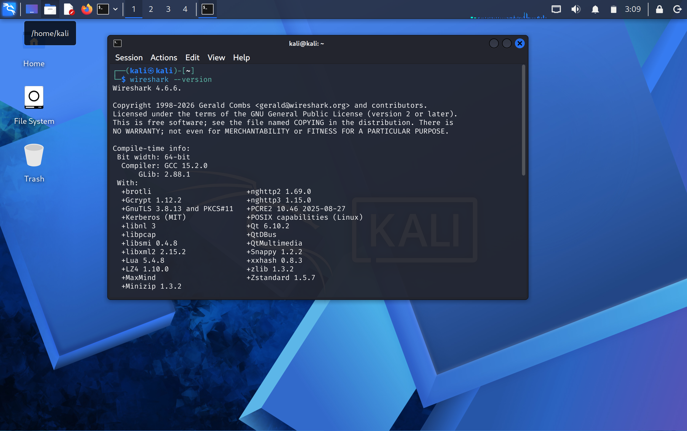

# Wireshark

## Overview

Wireshark is a network protocol analyzer used to capture and inspect network traffic.

In this lab, Wireshark is used from Kali Linux to observe and analyze traffic between Kali and the Metasploitable 2 target on the isolated `CYBERLAB` VMware LAN Segment.

## Installation and Verification

Kali Linux normally includes Wireshark.

Verify the installation with:

```bash
wireshark --version
```

Find the executable:

```bash
which wireshark
```

If Wireshark is not installed:

```bash
sudo apt update
sudo apt install wireshark
```

Verify the available network interfaces:

```bash
ip link
```


## Lab Network

The lab uses the isolated VMware LAN Segment:

```text
Network: CYBERLAB
Subnet: 192.168.200.0/24
```

VM addressing:

```text
Kali Linux:       192.168.200.20
Metasploitable 2: 192.168.200.10
```

Wireshark should capture traffic from the network interface connected to `CYBERLAB`.

## Starting a Capture

Start Wireshark:

```bash
wireshark
```

Select the network interface connected to the `CYBERLAB` LAN Segment.

Start the capture and generate traffic from Kali.

For example:

```bash
ping -c 4 192.168.200.10
```

Stop the capture after the test is complete.

## Capture Filters

Capture filters determine which traffic Wireshark captures.

Capture traffic involving Metasploitable 2:

```text
host 192.168.200.10
```

Capture traffic between Kali and Metasploitable 2:

```text
host 192.168.200.20 and host 192.168.200.10
```

Capture only ICMP traffic:

```text
icmp
```

Capture TCP traffic:

```text
tcp
```

## Display Filters

Display filters are applied after packets have been captured.

Show ICMP packets:

```text
icmp
```

Show traffic involving Metasploitable 2:

```text
ip.addr == 192.168.200.10
```

Show traffic between Kali and Metasploitable 2:

```text
ip.addr == 192.168.200.20 && ip.addr == 192.168.200.10
```

Show traffic from Kali:

```text
ip.src == 192.168.200.20
```

Show traffic to Metasploitable 2:

```text
ip.dst == 192.168.200.10
```

Show TCP traffic:

```text
tcp
```

Show HTTP traffic:

```text
http
```

Show DNS traffic:

```text
dns
```

## Basic Packet Analysis

A basic packet-analysis workflow is:

```text
1. Start capture
        ↓
2. Generate test traffic
        ↓
3. Stop capture
        ↓
4. Apply a display filter
        ↓
5. Inspect packet details
        ↓
6. Identify protocols and endpoints
        ↓
7. Document observations
```

For example, capture ICMP traffic while running:

```bash
ping -c 4 192.168.200.10
```

Then use:

```text
icmp
```

to isolate the ping packets.

Inspect:

* Source IP
* Destination IP
* ICMP type
* ICMP code
* Packet length
* Ethernet source and destination addresses

## Useful Protocols

| Protocol | Purpose                                     |
| -------- | ------------------------------------------- |
| ARP      | Resolves IPv4 addresses to MAC addresses    |
| ICMP     | Network connectivity and diagnostic traffic |
| TCP      | Reliable transport protocol                 |
| UDP      | Connectionless transport protocol           |
| HTTP     | Web traffic                                 |
| FTP      | File transfer                               |
| SSH      | Secure remote access                        |
| DNS      | Name resolution                             |

## Saving Captures

Wireshark captures can be saved as `.pcapng` files.

Use:

```text
File → Save As
```

Recommended location for lab captures:

```text
labs/
```

Use descriptive filenames, for example:

```text
icmp-ping-metasploitable.pcapng
```

Avoid committing unnecessarily large capture files to the repository.

## Lab Workflow

Wireshark should be used alongside Nmap and other security tools.

Example workflow:

```text
Nmap
  ↓
Identify services
  ↓
Wireshark
  ↓
Observe network traffic
  ↓
Analyze protocol behavior
  ↓
Document findings
```

Packet captures can provide additional context for understanding network and application behavior during security exercises.

## Lab Scope

Wireshark captures in this project are restricted to the isolated `CYBERLAB` VMware network.

Authorized lab systems:

```text
Kali Linux:       192.168.200.20
Metasploitable 2: 192.168.200.10
```

Only capture traffic belonging to the authorized lab environment.

## Documentation

General Wireshark usage is documented in this file.

Specific packet captures, analysis, screenshots, and observations should be documented under the `labs/` directory.

## References

Wireshark documentation:

```text
https://www.wireshark.org/docs/
```

Wireshark User's Guide:

```text
https://www.wireshark.org/docs/wsug_html/
```
