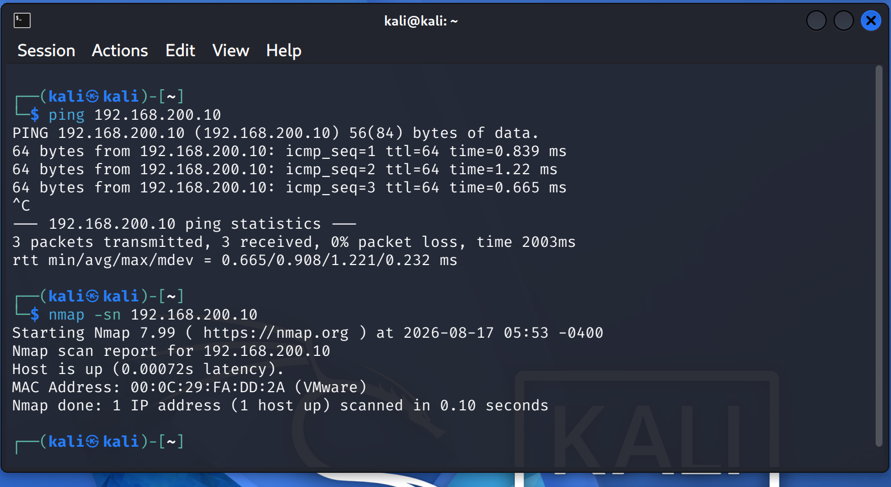
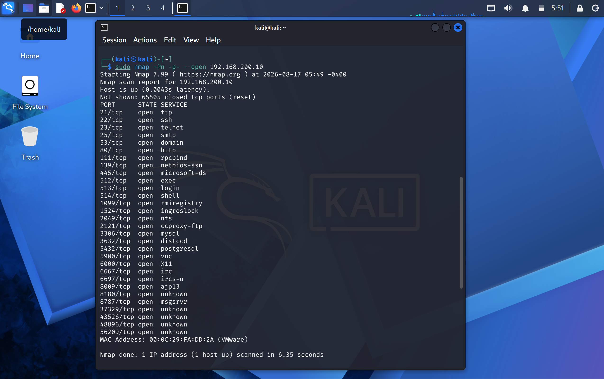
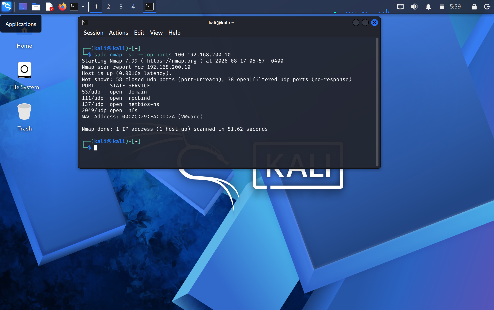

# Reconnaissance

## 1. Overview

Reconnaissance is the initial technical phase of the penetration test. The objective is to identify the target, verify connectivity, confirm that the host is active, and identify exposed network ports before moving to service enumeration.

The assessment is performed against a controlled Metasploitable 2 system inside the isolated CYBERLAB network.

> **Disclaimer:** Qelvaris Technologies Private Limited is a fictional company created solely for this cybersecurity lab and documentation exercise. No real company, system, or production environment is involved.

---

## 2. Target Information

| Item | Details |
|---|---|
| Client | Qelvaris Technologies Private Limited |
| Target | Metasploitable 2 |
| Target IP | 192.168.200.10 |
| Tester | Kali Linux |
| Tester IP | 192.168.200.20 |
| Network | CYBERLAB |
| Assessment Type | Black Box |

---

## 3. Objectives

The reconnaissance phase was performed to:

- Verify connectivity with the target.
- Confirm that the target is active.
- Identify exposed TCP ports.
- Identify exposed UDP ports.
- Establish the initial attack surface for further enumeration.

---

## 4. Connectivity and Host Discovery

Connectivity to the target was first verified using ICMP.

### Command

```bash
ping 192.168.200.10
```

The target responded successfully with no packet loss.

Nmap host discovery was then performed to confirm that the target was active.

### Command

```bash
nmap -sn 192.168.200.10
```

### Result

```text
Nmap scan report for 192.168.200.10
Host is up
MAC Address: 00:0C:29:FA:DD:2A (VMware)
```

The target was confirmed to be reachable and active.

### Evidence



---

## 5. TCP Port Discovery

A full TCP port scan was performed to identify exposed TCP services.

### Command

```bash
sudo nmap -Pn -p- --open 192.168.200.10
```

### Result

Multiple TCP ports were identified as open, including:

```text
21/tcp     ftp
22/tcp     ssh
23/tcp     telnet
25/tcp     smtp
53/tcp     domain
80/tcp     http
111/tcp    rpcbind
139/tcp    netbios-ssn
445/tcp    microsoft-ds
512/tcp    exec
513/tcp    login
514/tcp    shell
1099/tcp   rmiregistry
1524/tcp   ingreslock
2049/tcp   nfs
2121/tcp   ccproxy-ftp
3306/tcp   mysql
3632/tcp   distccd
5432/tcp   postgresql
5900/tcp   vnc
6000/tcp   X11
6667/tcp   irc
6697/tcp   ircs-u
8009/tcp   ajp13
8180/tcp   http
8787/tcp   msgsrvr
```

The results indicated a large exposed TCP attack surface and provided the basis for the subsequent enumeration phase.

### Evidence



---

## 6. UDP Port Discovery

A UDP scan of the top 100 ports was performed to identify commonly exposed UDP services.

### Command

```bash
sudo nmap -sU --top-ports 100 192.168.200.10
```

### Result

The scan identified the following open UDP ports:

```text
53/udp     domain
111/udp    rpcbind
137/udp    netbios-ns
2049/udp   nfs
```

These services were noted for further enumeration.

### Evidence



---

## 7. Reconnaissance Findings

| Category | Finding |
|---|---|
| Target status | Host is up |
| Target IP | 192.168.200.10 |
| Tester IP | 192.168.200.20 |
| Virtualization | VMware |
| TCP exposure | Multiple open TCP ports |
| UDP exposure | 4 open UDP ports identified |
| Initial attack surface | High |

The reconnaissance phase identified a broad network attack surface consisting of multiple exposed TCP and UDP services.

No vulnerability conclusions were made during this phase.

---

## 8. Conclusion

The target was successfully identified and confirmed to be reachable from the Kali Linux testing system.

TCP and UDP port discovery revealed multiple exposed services requiring further investigation.

The reconnaissance phase is complete.

The assessment proceeds to **Enumeration**, where the identified services will be examined in greater detail to determine their versions, configurations, accessible resources, and potential security weaknesses.