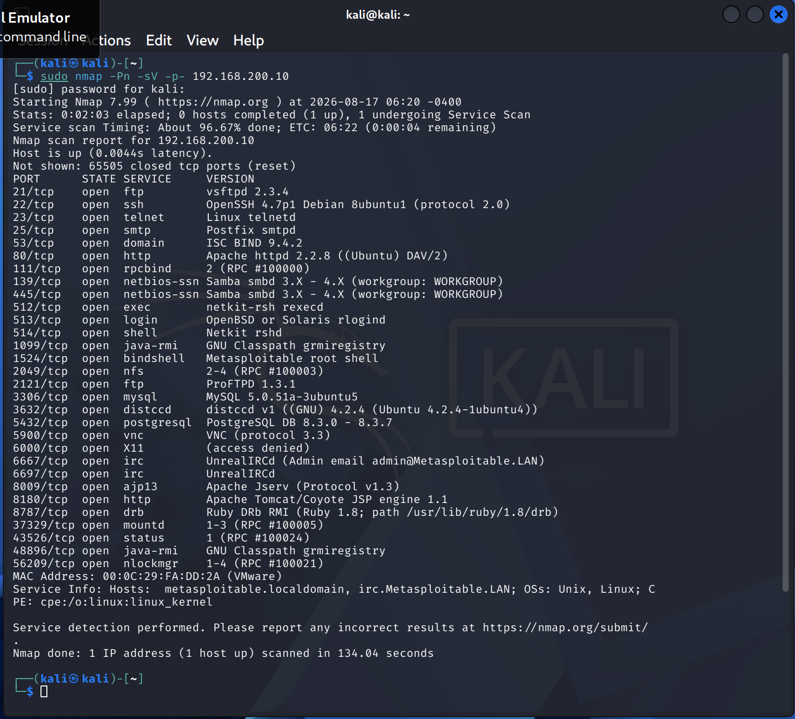
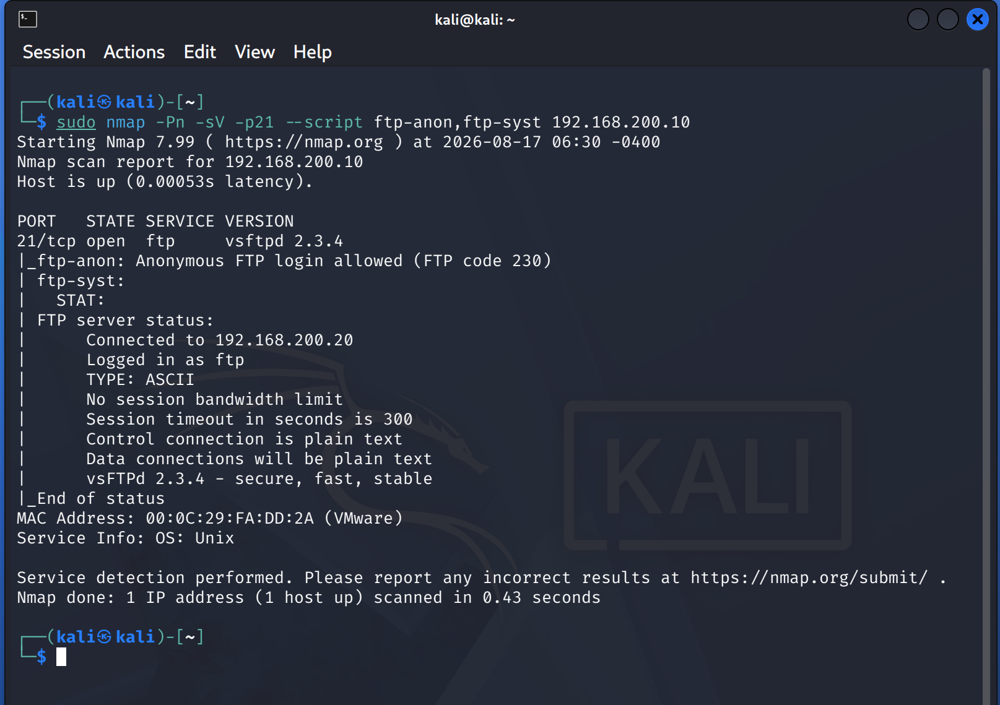
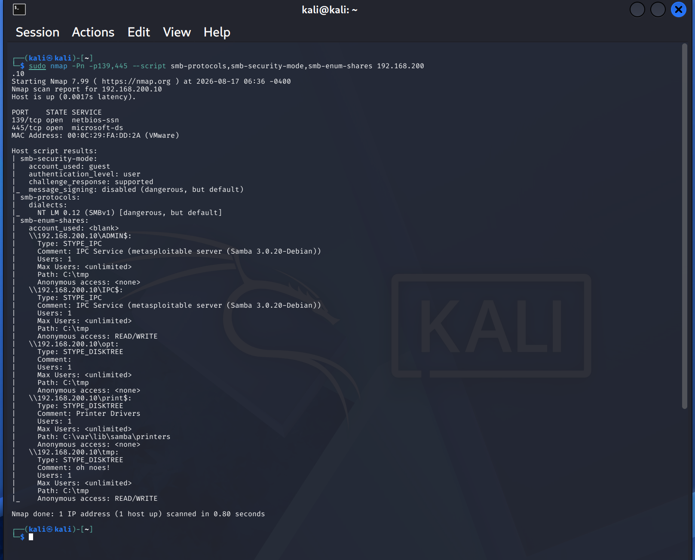
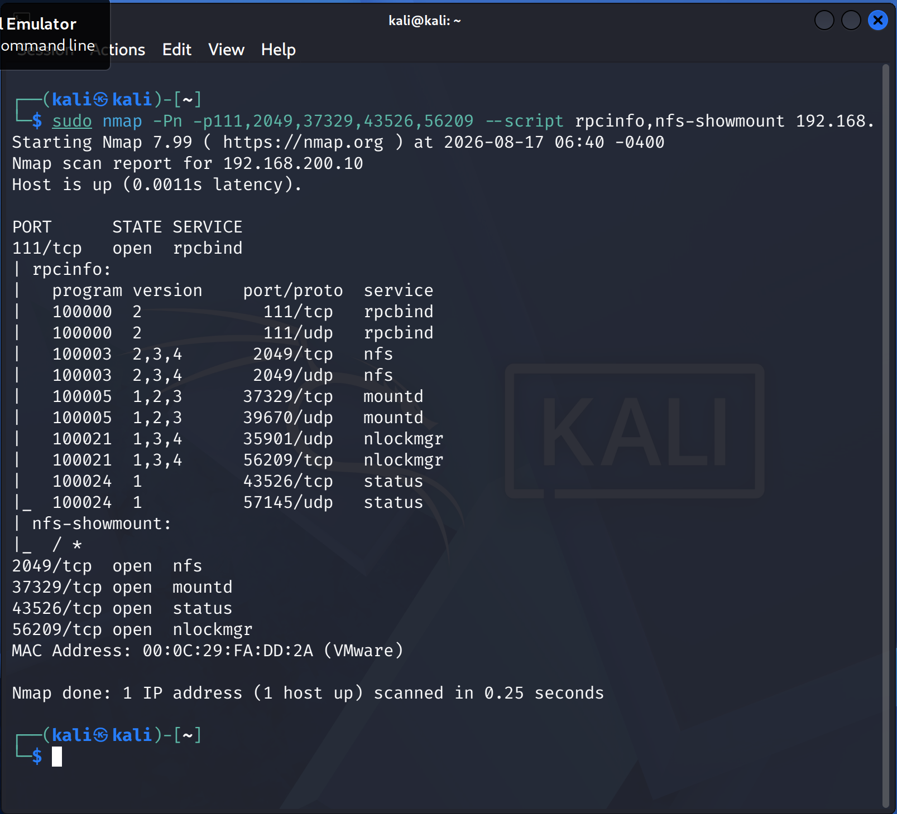
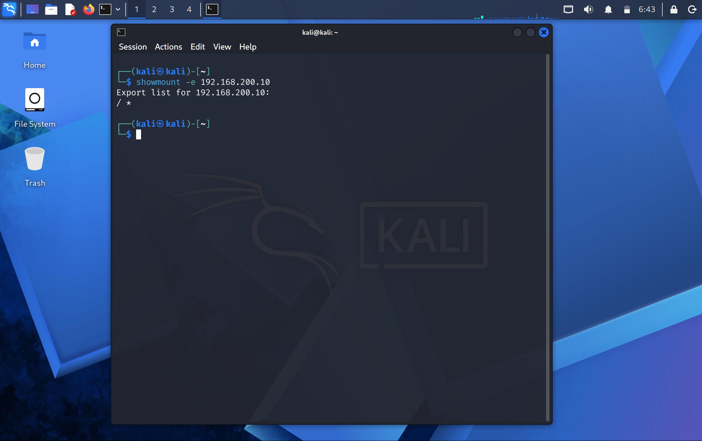
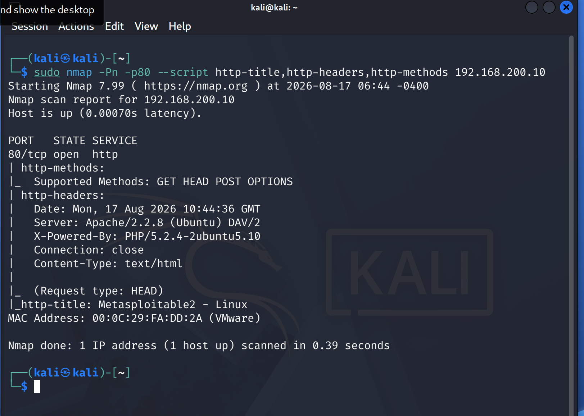
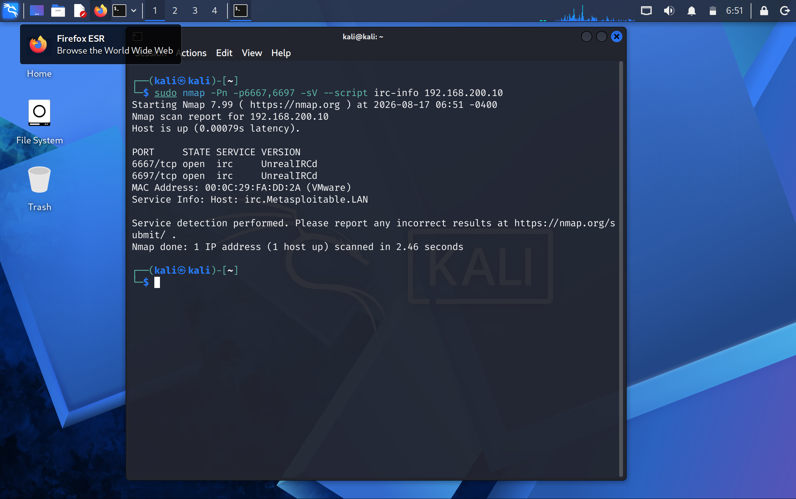
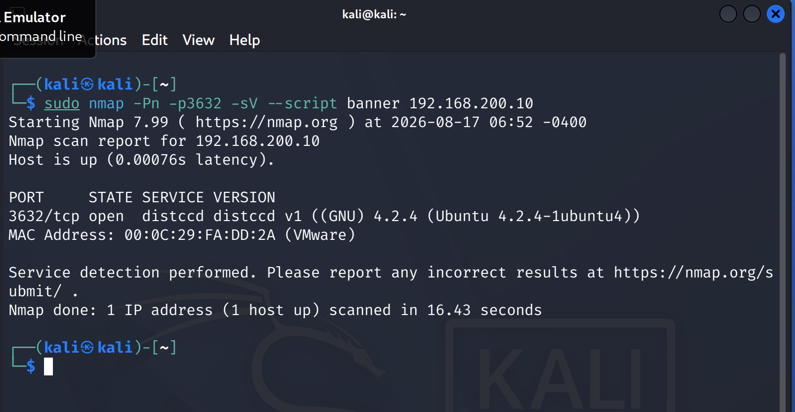

# Enumeration

## Objective

Identify the services, versions, configurations, and accessible resources exposed by the target discovered during reconnaissance.

**Target:** Metasploitable 2  
**Target IP:** `192.168.200.10`

---

## 1. Service and Version Enumeration

### Command

    sudo nmap -Pn -sV -p- 192.168.200.10

### Findings

The scan identified multiple exposed services, including:

- FTP — vsftpd 2.3.4
- SSH — OpenSSH 4.7p1
- Telnet
- SMTP — Postfix
- DNS — BIND 9.4.2
- HTTP — Apache 2.2.8
- SMB — Samba
- RPC/NFS
- MySQL
- PostgreSQL
- IRC — UnrealIRCd
- distccd
- VNC
- Apache Tomcat
- Java RMI

---

## 2. FTP Enumeration

### Command

    sudo nmap -Pn -p21 --script ftp-anon,ftp-syst 192.168.200.10

### Findings

- FTP service is running on port `21`.
- Version identified as `vsftpd 2.3.4`.
- Anonymous FTP login is allowed.
- FTP connections are transmitted in plain text.

---

## 3. SMB Enumeration

### Command

    sudo nmap -Pn -p139,445 --script smb-protocols,smb-security-mode,smb-enum-shares 192.168.200.10

### Findings

- SMB is exposed on ports `139` and `445`.
- SMBv1 is enabled.
- SMB message signing is disabled.
- Multiple SMB shares are exposed.
- The `tmp` share allows anonymous read/write access.

---

## 4. RPC and NFS Enumeration

### Command

    sudo nmap -Pn -p111,2049,37329,43526,56209 --script rpcinfo,nfs-showmount 192.168.200.10

### Findings

- RPC services are exposed.
- NFS is available on port `2049`.
- `mountd`, `status`, and `nlockmgr` services were identified.
- NFS export information was accessible.

### NFS Export Enumeration

    showmount -e 192.168.200.10

### Result

    Export list for 192.168.200.10:
    / *

The target exposes the root filesystem through NFS to hosts represented by `*`.

---

## 5. HTTP Enumeration

### Command

    sudo nmap -Pn -p80 --script http-title,http-headers,http-methods 192.168.200.10

### Findings

- Apache version: `2.2.8`
- PHP version: `5.2.4`
- Supported HTTP methods:
  - GET
  - HEAD
  - POST
  - OPTIONS
- Web server title: `Metasploitable2 - Linux`
- Web server reports `DAV/2`.

The HTTP landing page also exposed several web applications, including:

- phpMyAdmin
- Mutillidae
- DVWA
- WebDAV
- Wiki

---

## 6. IRC Enumeration

### Command

    sudo nmap -Pn -p6667,6697 -sV --script irc-info 192.168.200.10

### Findings

- UnrealIRCd is running.
- Ports `6667` and `6697` are open.
- Host identified as `irc.Metasploitable.LAN`.

---

## 7. distccd Enumeration

### Command

    sudo nmap -Pn -p3632 -sV --script banner 192.168.200.10

### Findings

- distccd is running on port `3632`.
- Version identified as `distccd v1`.
- GCC version identified as `4.2.4`.

---

## Enumeration Summary

The enumeration phase identified several services and configurations requiring further assessment:

| Service | Key Finding |
|---|---|
| FTP | vsftpd 2.3.4, anonymous access |
| SMB | SMBv1 enabled, signing disabled, anonymous writable share |
| NFS | Root filesystem exported |
| HTTP | Apache 2.2.8, PHP 5.2.4, multiple applications |
| IRC | UnrealIRCd exposed |
| distccd | distccd v1 exposed |

These findings will be evaluated during the vulnerability assessment phase.

Enumeration findings are not treated as confirmed vulnerabilities until they are validated.
