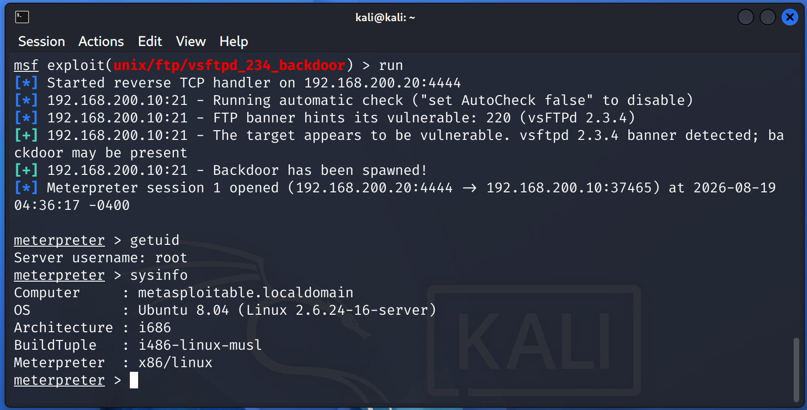
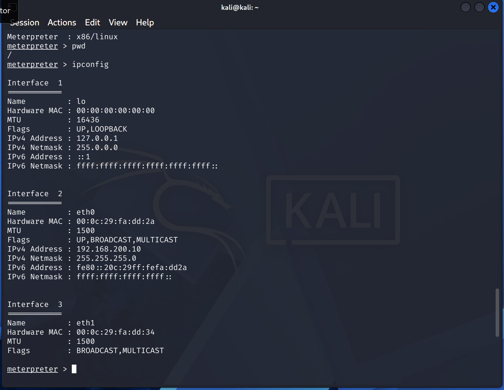
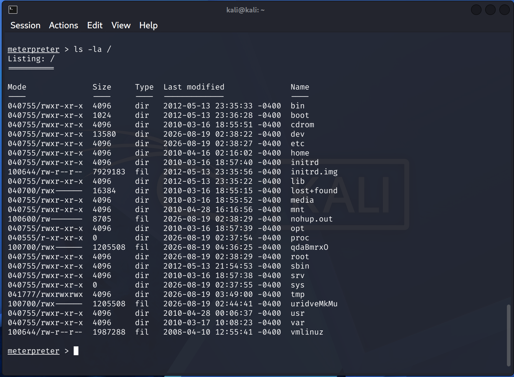
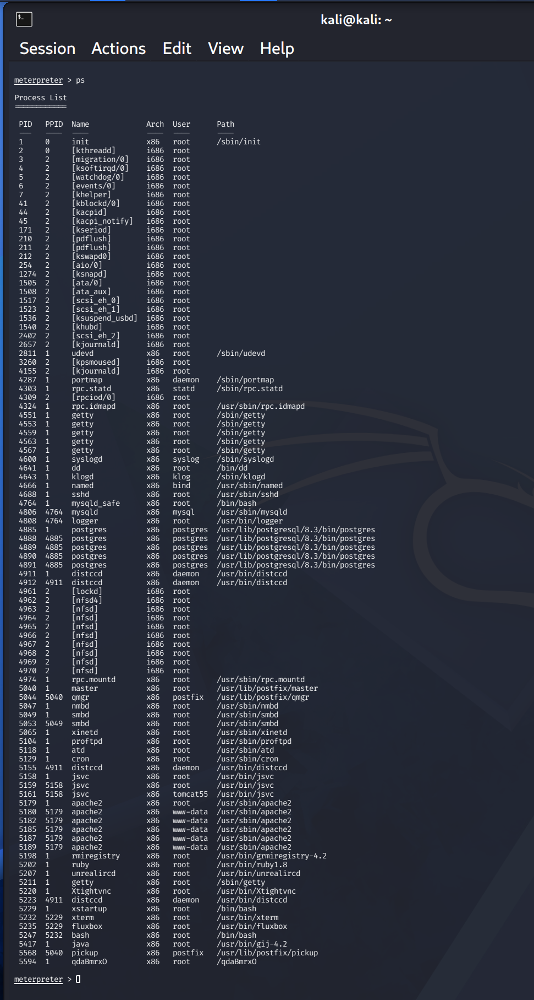
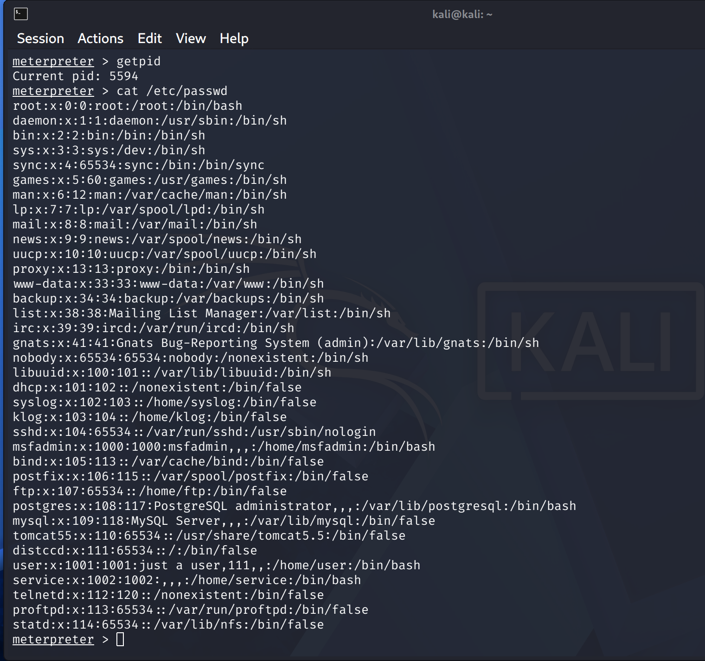
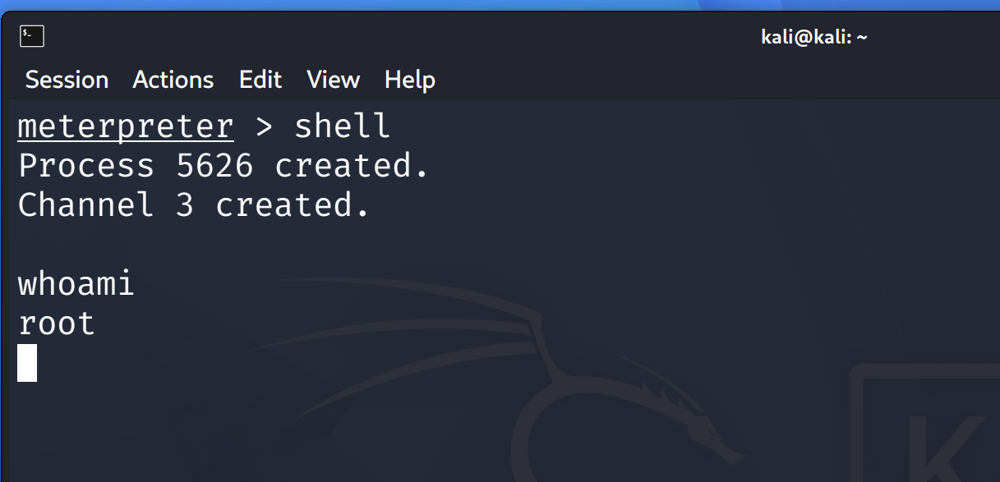
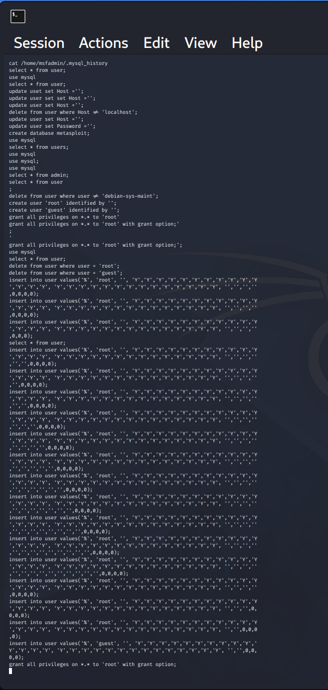

# Post-Exploitation

## Objective

The objective of this phase was to assess the compromised system and collect basic information after successful exploitation.

The activities included:

- Confirming the compromised session
- Identifying the current user and system
- Reviewing network configuration
- Inspecting the filesystem
- Reviewing running processes
- Enumerating local accounts
- Reviewing accessible application data

---

## 1. Confirm Compromised Session

The vsftpd 2.3.4 backdoor exploit successfully created a Meterpreter session.

```text
meterpreter > getuid
Server username: root
```
---

## 2. System Information

System information was collected using `sysinfo`.

```text
meterpreter > sysinfo

Computer    : metasploitable.localdomain
OS          : Ubuntu 8.04
Architecture: i686
Meterpreter : x86/linux
```



---

## 3. Network Configuration

The compromised host's network configuration was reviewed.

```text
meterpreter > ipconfig
```

The target was identified as:

- IP Address: `192.168.200.10`
- Network: `192.168.200.0/24`



---

## 4. Filesystem Enumeration

The root filesystem was inspected to identify accessible directories and files.

```text
meterpreter > pwd
/

meterpreter > ls -la /
```

Standard directories such as `/etc`, `/home`, `/root`, `/tmp`, `/usr`, and `/var` were accessible.



---

## 5. Process Enumeration

Running processes were reviewed to identify active services and applications.

```text
meterpreter > ps
```

The process list included services such as:

- Apache
- MySQL
- PostgreSQL
- Samba
- UnrealIRCd
- distccd



---

## 6. Local Account Enumeration

The `/etc/passwd` file was accessed to identify local accounts.

```text
meterpreter > cat /etc/passwd
```

The output contained system and service accounts, including accounts associated with:

- MySQL
- PostgreSQL
- Apache
- FTP
- IRC
- Other system services



---

## 7. Shell Access Verification

A system shell was opened from the Meterpreter session.

```text
meterpreter > shell

whoami
root
```

This confirmed that the shell was operating with root privileges.



---

## 8. Application Data Review

Accessible MySQL history data was reviewed.

```text
cat /home/username/.mysql_history
```

The history contained previously executed database commands and administrative queries.



---

## Findings

| Finding | Result |
|---|---|
| Meterpreter Session | Successful |
| Current User | `root` |
| Target IP | `192.168.200.10` |
| System Information | Collected |
| Network Information | Collected |
| Filesystem Access | Successful |
| Process Enumeration | Successful |
| Account Enumeration | Successful |
| Shell Access | Successful |
| Application Data Access | Successful |

---

## Conclusion

The successful exploitation of the vsftpd 2.3.4 backdoor provided root-level access to the target system.

Post-exploitation activities confirmed that the compromised host could be enumerated at the system, network, filesystem, process, account, and application levels.

Privilege escalation activities are documented separately in `privilege-escalation.md`.
